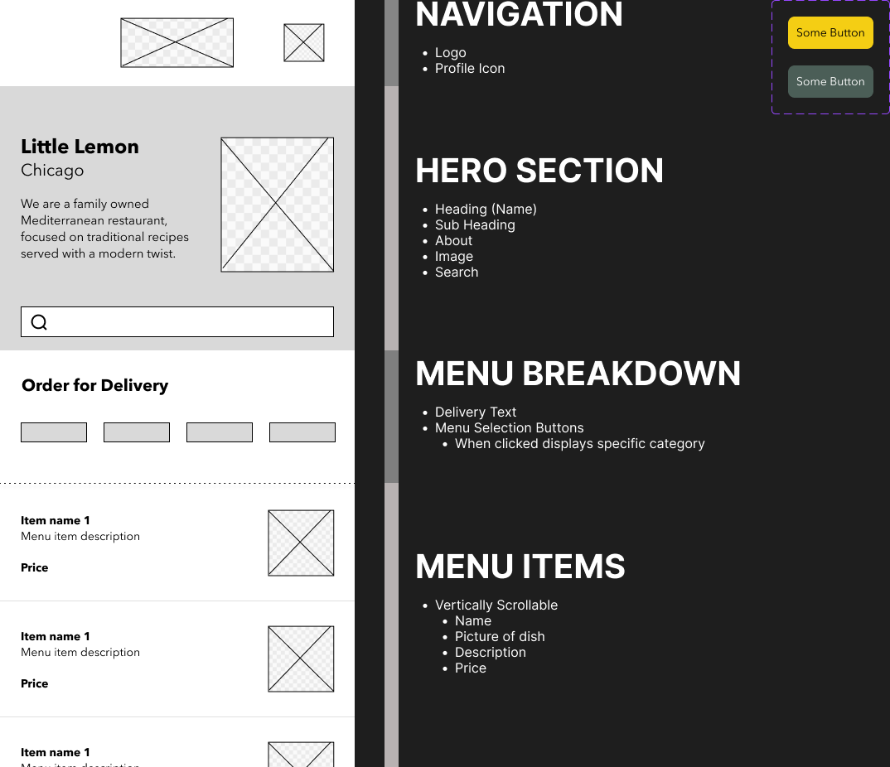
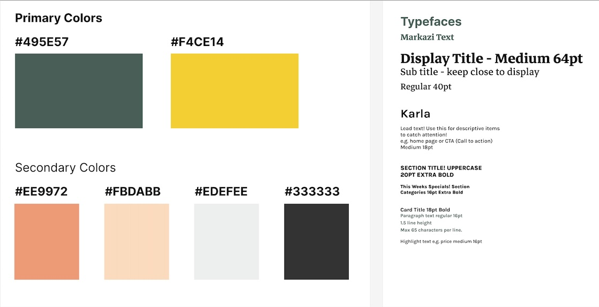

# Capstone Project for Coursera's Meta React Native Specialization

- Learner: Erick Patrick Alvarenga Rocha
- Submission date: 25.01.2025
- Figma file: [Check it here](prototype-table-booking-by-erick-rocha.fig)

Thank you for checking my project.

This is the repository for the Capstone project of the Coursera's Meta React Native Specialization. We are tasked of creating some sort of "Food delivery app" with super contrained functionality:

- Load menu items from API and save to local database (SQLite)
- Search and filter menu items from DB
- Save user information in App own storage
- Load images from internet

The curren project uses the latest Expo version which uses the Expo App Router. The Expo App Router allows to export js/jsx/ts/tsx filex from the `app` folder as a "screen". 

We define the default navigation type (stack, bottom navigator, modal) by configuring the `_layout.jsx` file. In my case, I'm using the `<Stack>` navigation type which is the same as using a Stack Navigator with a `<NavigationContainer>` from `@react-navigation/native` and `@react-navigation/native-stack`, but simpler.

In the Expo App Router case, the initial route and screen is the provided by the `app/index.jsx` file, which would be equivalent to the `OnBoarding.jsx` file we're expected to create in the course.

## Get started

1. Install dependencies

   ```bash
   npm install
   ```

2. Start the app

   ```bash
    npx expo start
   ```


# Wireframe


# Style Guide
